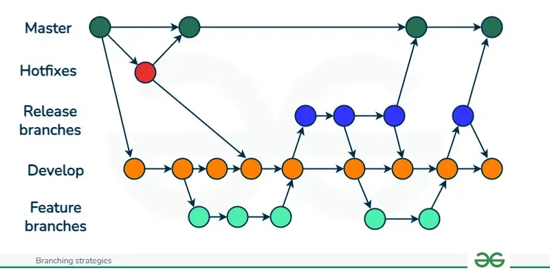
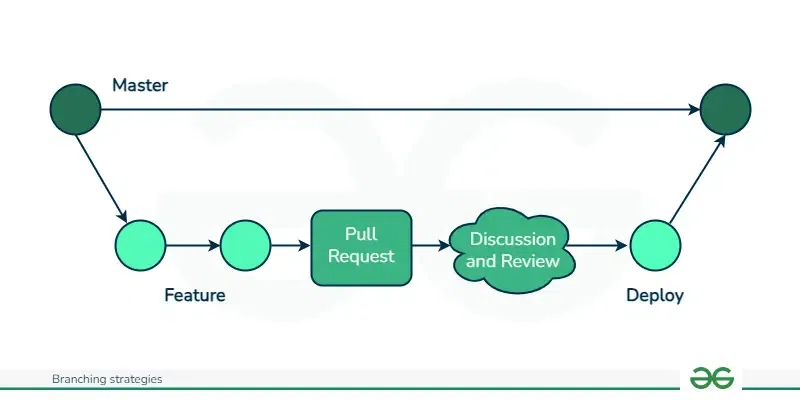
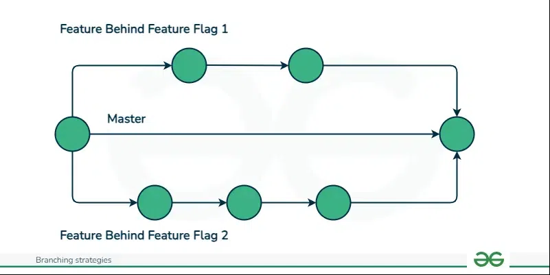

# Common Git Branching Strategies
The following are the common Git branching strategies:

# 1. Gitflow Workflow
GitFlow enables parallel development, allowing developers to work separately on feature branches. A feature branch is created from a master branch, and after completion of changes the feature branch is merged with the master branch.

The types of branches that are present in GitFlow for different purposes:

Master: Used for product release
Develop: Used for ongoing development
Feature Branches: Created from the develop branch to work on specific features.
Release Branches: Created from the develop branch to prepare for production releases and bug fixes
Hotfix Branches: Created from the master branch to address urgent issues directly in production.It helps in addressing discovered bugs smoothly, allowing developers to continue their work on the develop branch while the issue is resolved.
The Master and Develop branches are the main branches that remain throughout the journey of the software. The other branches are supporting branches and are short-lived that serving specific purposes.

Gitflow Architecture

# Pros of Gitflow
Facilitates parallel development, ensuring stability in production while developers work on separate branches.
Organizes work effectively with branches for different purposes.
Ideal for managing multiple versions of production code.
GitFlow streamlines the release management process.
Ensures smooth merging of new features into the main codebase, reducing conflicts.
GitFlow offers a well-defined procedure for addressing bugs and deploying hotfixes, facilitating their rapid integration into production environments.

# Cons of Gitflow
Complexity increases as more branches are added, potentially leading to difficulties in management.
Merging changes from development branches to the main branch requires multiple steps, increasing the chance of errors and merge conflicts.
Debugging issues becomes challenging due to the extensive commit history.
GitFlow's complexity may slow down the development process and release cycle, making it less suitable for continuous integration and delivery.

# 2. GitHub Flow
GitHub flow is a simpler alternative to GitFlow, best for smaller teams and projects. GitHub flow only has feature branches that stem directly from the master branch and are merged back to master after completing changes. There are no release branches in GitHub Flow. The fundamental concept of this model revolves around maintaining the master code in a consistently deployable condition. Which enables the seamless implementation of faster release cycles, continuous integration and delivery workflows.

The types of branches that are present in GitFlow are:

Master: The GitHub Flow starts with the master branch, which contains the most recent stable code ready for release.
Feature: Developers initiate feature branches from the main branch to implement new features or address bugs. Upon completion, the feature branch is merged back into the main branch. If a merge conflict arises, developers are required to resolve it prior to finalizing the merge.

Github flow Architecture

# Pros of Github Flow
GitHub Flow emphasizes fast, streamlined branching, short production cycles and frequent releases, aligning well with Agile methodologies.
Teams can quickly identify and resolve issues due to the strategy's focus on fast feedback loops.
Testing and automating changes to a single branch enable quick and continuous deployment.
GitHub Flow is particularly well-suited for small teams and web applications, where maintaining a single production version is sufficient.

# Cons of Github Flow
GitHub Flow is not ideal for managing multiple versions of the codebase.
The lack of development branches can lead to unstable production code if changes are not properly tested before merging.
Without separate development branches, the master branch can become cluttered, serving both production and development purposes.
As teams grow, merge conflicts may occur more frequently due to everyone merges into the same branch.

# 3. GitLab Flow
GitLab flow is more scalable alternative to GitFlow. It is designed for teams using GitLab as their version control system and offers a more flexible approach to continuous integration and automated testing. These forms the core elements of GitLab Flow, guaranteeing the stability of the master branch.

The types of branches that can be present in GitFlow are:

Master: Main production branch housing stable release ready code.
Develop: Contains new features and bug fixes.
Feature: Developers initiate feature branches from the develop branch to implement new features or address bugs. Upon completion, they integrate the changes from the feature branch into the develop branch.
Release: Prior to a new release, a release branch is created from the develop branch. This branch is used to combine new features and bug fixes for the release. Upon completion, developers merge the changes from the release branch into both the develop and main branches.

Gitlab Flow Architecture

# Pros of Github Flow
GitLab Flow offers a robust and scalable Git branching strategy, particularly suitable for larger teams and projects.
This approach ensures a distinct separation between code under development and production-ready code, minimizing the risk of accidental changes to the production code.
With GitLab Flow, each feature is developed in its own branch, promoting independent development and reducing conflicts during integration into the main codebase.
The use of separate branches enables developers to work concurrently on different features, leading to quicker feature development.

# Cons of Github Flow
GitLab Flow may pose challenges due to its complexity, particularly for teams new to Git.
Merging feature branches into the develop branch can result in conflicts, as these branches may diverge from the develop branch over time.
The GitLab Flow strategy may slow down development, as it requires merging changes into the develop branch before release. This could be problematic for teams requiring rapid release of new features and bug fixes.

# 4. Trunk Based Development( most company use this)
It is a branching strategy where developers work on a single "trunk" branch, mostly the master branch and use feature flags to isolate features until they are ready for release. This main branch should be ready for release any time. No additional branches are created.

The main idea behind this strategy is to make small, frequent changes to avoid merge conflicts and limit long-lasting branches. This strategy enables continuous integration and delivery, making it an attractive choice for teams aiming to release updates regularly and smoothly. It is especially useful for smaller projects or teams looking for a simpler workflow.

Trunk Based Develpment Architecture

# Pros of Trunk Based Development
It keeps the trunk consistently updated, enabling continuous integration of code changes.
Developers have better visibility into each other's changes as commits are made directly to the trunk, promoting collaboration and transparency.
Without the need for branches, there is less likelihood of encountering merge conflicts or "merge hell," as developers push small changes more frequently, simplifying conflict resolution.
The shared trunk remains in a constant releasable state, allowing for faster and more stable releases due to the continuous integration of work.

# Cons of Trunk Based Development
Requires high autonomy from developers, making it suitable for experienced teams.
It demands a considerable level of discipline and effective communication among developers to prevent conflicts and ensure proper isolation of new features.
Difficult to manage with large teams.
Maintaining backward compatibility with older releases can be challenging.

Picking the Right Branching Strategy
Git offers a wide range of branching strategies, each suited to different project requirements and team dynamics. For beginners, starting with simpler approaches like GitHub Flow or Trunk-based development is recommended, gradually advancing to more complex strategies as needed. Feature flagging can also help reduce the necessity for excessive branching.

GitFlow is beneficial for projects requiring strict access control, particularly in open-source environments. However, it may not align well with DevOps practices. Therefore, teams seeking an Agile DevOps workflow with strong support for continuous integration and delivery may find GitHub Flow or Trunk-based development more suitable. Ultimately, the choice of branching strategy depends on the specific needs and goals of the project and team.

