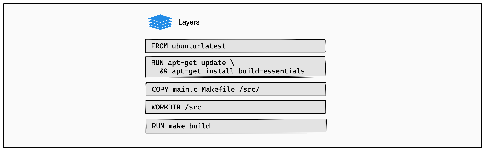
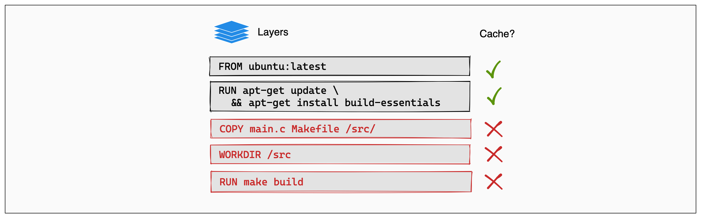

## You made change in your code, rebuilt the image, but the change isn't reflected?

### Question  
You made a change in your application code, rebuilt the Docker image, but the container still shows old behavior. What could be the issue?

### Short explanation of the question  
This scenario tests your understanding of Docker image layers, caching behavior during `docker build`, and volume mounting in development setups.

### Answer  
This usually happens due to either build caching or the container using a volume that overrides the updated code. I’d verify that the image was rebuilt correctly and ensure no volume is masking the changes.

### Detailed explanation of the answer for readers’ understanding

There are two common culprits for this issue:

---

### 🧱 1. **Docker build cache**

Docker caches image layers to speed up builds. If no changes are detected in a layer’s context, it reuses the cached layer. This can skip the step that copies new code into the image.

#### ✅ Fix

Use the `--no-cache` flag while building:

```bash
docker build --no-cache -t myapp:latest .
```

Also ensure that `COPY` instructions are placed **after** dependencies to avoid skipping due to unchanged upper layers.

```Dockerfile
# BAD: Code copied early, everything cached
COPY . .

# GOOD: Dependencies first, then app code
COPY requirements.txt .
RUN pip install -r requirements.txt
COPY . .
```

---

### 📦 2. **Volume overwriting image content**

When you run a container with a volume mounted to a directory like `/app`, it **overrides** whatever was built into the image at that path.

```bash
docker run -v "$(pwd)":/app myapp
```

If you rebuild the image with updated code, but still mount your old source directory, the container sees your **local files**, not what's in the image.

#### ✅ Fix

- Either remove the volume mount
- Or update your local files too

---

### 🔍 Steps to verify

- Run a shell inside the image and check the file contents:
  ```bash
  docker run -it myapp:latest cat /app/main.py
  ```

- Check the list of running containers:
  ```bash
  docker ps
  ```

- Make sure you’re running the updated image:
  ```bash
  docker images | grep myapp
  ```

---

### 🧠 Real-world Insight

> “I once rebuilt a Node.js app image after updating source code. But due to a `-v "$(pwd)":/app` bind mount, it kept running the old code from my host system, not from the newly built image. Took me a while to realize the mount was masking the update.”

---

### Key takeaway

> "If Docker changes aren’t reflected, check for caching in `docker build` and make sure no local volumes are masking your image content."

## concept-Docker build cache

When you build the same Docker image multiple times, knowing how to optimize the build cache is a great tool for making sure the builds run fast.

How the build cache works
Understanding Docker's build cache helps you write better Dockerfiles that result in faster builds.

The following example shows a small Dockerfile for a program written in C.


# syntax=docker/dockerfile:1

FROM ubuntu:latest
RUN apt-get update && apt-get install -y build-essentials
COPY main.c Makefile /src/
WORKDIR /src/
RUN make build

Each instruction in this Dockerfile translates to a layer in your final image. You can think of image layers as a stack, with each layer adding more content on top of the layers that came before it:



Image layer diagram
Whenever a layer changes, that layer will need to be re-built. For example, suppose you make a change to your program in the main.c file. After this change, the COPY command will have to run again in order for those changes to appear in the image. In other words, Docker will invalidate the cache for this layer.



If a layer changes, all other layers that come after it are also affected. When the layer with the COPY command gets invalidated, all layers that follow will need to run again, too:

Image layer diagram, showing cache invalidation
And that's the Docker build cache in a nutshell. Once a layer changes, then all downstream layers need to be rebuilt as well. Even if they wouldn't build anything differently, they still need to re-run.