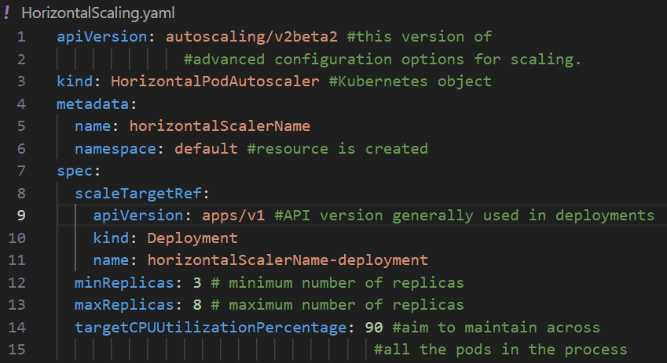

# Types of Scaling in Kubernetes
There are primarily two types of scaling,

1. Horizontal scaling/Horizontal Pod Autoscaler (HPA): This feature can effortlessly add or release pod replicas automatically.
2. Vertical scaling/Vertical Pod Autoscaler (VPA): This feature in which CPU and memory reservations adjust automatically.

## How To Use Scaling?

In order to use scaling we need configuring our cluster to automatically change by the number of pods. depend on workload needs(i.e. horizontal and vertical scaling). 

### Horizontal Scaling

Prerequisites

"kubectl" installed and configured to communicate.
Make sure Metrics Server in deployed.
Create a resource definition in a YAML file.

Deployment:
kubectl apply -f HorizontalScaling.yaml 

Monitor the Deployment:
kubectl get deployment horizontalScalerName-deployment -n default

### Vertical Scaling

Just like Horizontal Scaling, makes sure we have cluster and "kubectl".
Deploy components in the cluster in case they are not already established.
Create a resource definition in a YAML file, for vertical scaling.

Deployment:
kubectl apply -f VerticalScaling.yaml
Monitor the Kubernetes Deployment :
kubectl get deployment verticalScalerName-deployment -n default